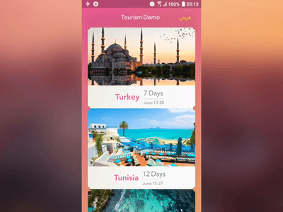

A Flutter tourism app that is backed-by Redux, shows animations (with 3D rotation), internationalization (i18n, English <=> Arabic), ClipPath, and fonts.

### Screenshots

[YouTube demo](https://youtu.be/31WL1ep1Ce8)

<!-- ### Credits
-  -->